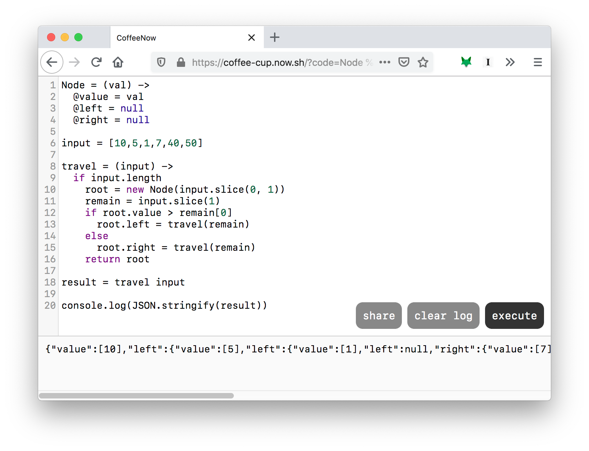

# Coffee Now

Coffee Now is a CoffeeScript playground that execute code directly on your browser, it's not sending the code to any other
server to do so.

The UI is minimal so you can use it anywhere and anytime, especially on mobile device.



Let me repeat, all of the code are execute right on your browser, please proceed with care!!! I don't write this app with
your best interest in mind.

# Usage

- Use your keyboard, type in the code
- Press Cmd + Enter or Ctrl + Enter if you're on a desktop
- If you're on mobile, hit the Execute button
- That's it.

You can share your code by click on the Share button, then copy the page URL and send it to anyone.

# Try it Online

You can try it at https://coffee-cup.now.sh

# Host it yourself

You can deploy Coffee Now as a static HTML page anywhere you want, for example, I'm using [ZEIT Now](https://zeit.co/home).

```
$ yarn install
$ yarn dist
$ cd dist
$ now
```

# Why am I building this?

During my parental leave, I found myself solving programming challenges for fun on my phone on and off, because you can't just
sitting at a laptop when you a baby just waiting to cry every random hours for every random reason.

Most of the coding playground I can find online are just sucks, they either breaking the editing experience on the mobile
or behave badly on small screen devices. Also, they send the code to a remote server to execute it before showing you the
result, which is a waste. I'm using CoffeeScript and it should be compiled to JavaScript to run in the browser at my finger tip.

Oh, now you ask, why the "dead language"? I like do more with less, and the beautiful syntax of CoffeeScript help me write less,
especially writing code on mobile. That's why.

See JOURNAL.txt for more details.
